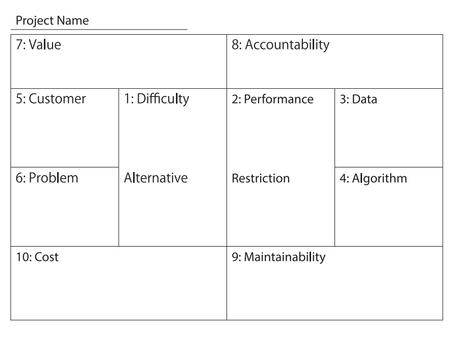

## PoC キャンバスとは

PoC 計画を議論するためのフレームワークで、著者が独自に作ったらしい。
検索してみたら次の論文を見つけた: [PoCキャンバスを用いた機械学習システムの開発プロセスの管理手法](https://jssst.or.jp/files/user/taikai/2019/MLSE/mlse1-3.pdf)。
論文の著者の土肥 拓生さんがこの本の執筆者なのかな？

本で紹介されているキャンバスの方が使いやすい気はするが、雰囲気は同じ。
PoC キャンバスを埋めることさえ意識していれば PoC で抑えておくべき観点 (cf. `chap1.md`) を自動的に意識できそう。
miro などのオンラインサービスの使用が推奨されているが、機密情報を含むし、上司を説得するのもめんどいので、画像をキャプチャしてパワポに貼り付けてから付箋を貼るなどの方法で検討すると思う。
2 月から始まりそうな PoC で早速使ってみよう。