# 絵を見る 7 つ道具

## 17 世紀の巨匠と現代アートを比較してみる

絵画を分析するための枠組みとして色・明暗・輪郭・形・筆触がある。
この枠組みを通して絵画を見る体験をするために描かれる対象と構図が同じ２つの絵画を見比べてみる。

**Q**: 色、明暗、輪郭、形、筆触に注目してベラスケス（左）とベーコン（右）の違いを言語化しよう。

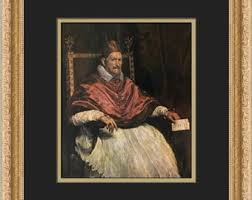

- 色
  - ベラスケスは明るい赤と白が目立つが、ベーコンは白を除いて暗い色で統一されている
  - ベーコンの絵画の下半分には黄色の原色が使われており、ベラスケスには見られない
- 明暗
  - ベラスケスとベーコンはともに背景が暗いが、ベーコンは人物も暗い
  - ベーコンのほうがコントラストが小さく、絵画全体が暗い印象を持っている
- 輪郭
  - ベラスケスは人物や物体の輪郭が鮮明に描いている
  - 一方でベーコンの絵画は顔や手の輪郭が潰れている
- 形
  - ベラスケスの絵画は物体こそ幾何学的な形を持っているが、人物は自然な丸い形を持っている
  - ベーコンの人物の形は直線的で硬い印象を受ける
  - また、画面下部に黄色の直線が追加されている点も幾何学的な印象を強めている
- 筆触
  - ベラスケスは滑らかな筆触で非常に写実的な印象を受ける
  - ベーコンは絵画上部に垂直な縦線が目立ち、絵画下部にはインノケンティウスの下半身から周囲に伸びる線が追加されている

ベーコンの筆触は激しく、画家が素早く筆を動かして絵に動きを追加している事がわかる。
静かで落ち着いた印象を与えるベラスケスの絵画に対し、ベーコンの絵画は動的で叫んでいるような印象を与えるが、これにはベーコンの筆触による効果が一役買っている。

## 5 つの道具を深堀りする

### 色

絵画の色を確認するときは鮮やかさのパラメータ = 彩度を確認する。
彩度が高いと鮮やかで、低いと淡い・鈍い色になる。

- （左）彩度の高い色で画面を構成するときらびやかかつ平面的な印象を与える。
- （右）彩度の低い色で画面を構成すると印象が落ち着いて立体的な印象を与える。

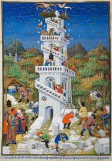
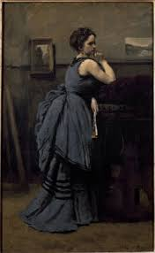

### 明暗

明暗の差を見る。

- （左）明暗の差が大きい絵画では、絵画内の何かが強調され浮き上がって見える。
- （右）一方で差が小さい絵画では、薄靄がかかったような印象になり、繊細な色の移り変わりが見える。
  - 画像はコントラストが強調されてしまっているが、書籍内の画像だともっとぼんやりしている。

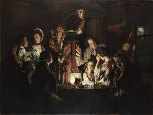
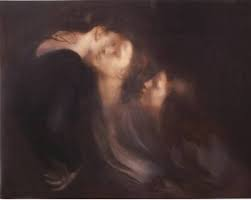

### 輪郭

明瞭な輪郭を持つ対象は周囲の環境から切り離され、ピントが合ったように高解像度である印象を与える。
不明瞭な輪郭を持つ対象は周囲の環境と連続的なものとして描かれ、ピントが合わないようなぼんやりした印象を与える。

- （左）強弱を持つ輪郭線を肥痩線という。肥痩線は動的な印象を与える。
- （右）輪郭線が完全になくなった絵画の例。

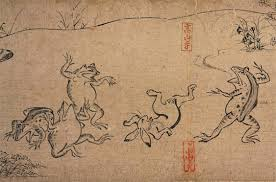
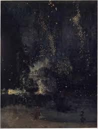

現実の世界には明確な輪郭はないので、絵画内の輪郭は画家が意識的に構成するものである。
この意味で明瞭な輪郭線を持つ絵画は理知的で、画家が強調したい要素が全面に（あからさまに）押し出されている。

一方で現実に即した不明瞭な輪郭線を持つ絵画は我々人間の自然な認識（感覚）に訴えるような絵画である。

### 形

有機的な形からは柔らかく自由な印象を、幾何学的な形からは硬く秩序立った印象を受ける。
また、同じ形（相似）が繰り返されているかどうかも確認すべき。

- （左）丸っこくて脱力したような印象。
- （右）三角形の繰り返しで衣服のシワが表現されており硬い印象。

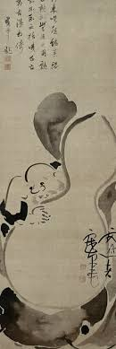
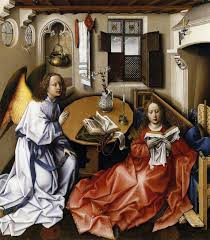

### 筆触

筆触には画家の個性が反映される。
筆を動かす速さ、筆圧など、その絵画をどのように作成したのかがよく分かる。

一方で滑らかな塗で筆触を残さない絵画からは人が関与したような印象を受けず、超越的な雰囲気が漂う。

- （左）筆触が反映された絵
- （右）滑らかな塗の絵

宗教画では超越的な印象を与えたいから塗りが滑らかなものが多いのかな？？

## ゴヤとマネの比較 6 つ目、7 つ目の道具

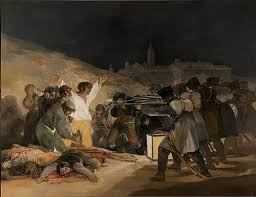
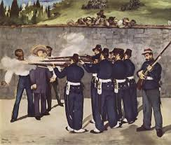

2 つの絵画にあらわれているゴヤっぽさ・マネっぽさは 5 つ道具では説明できない。
まずは 5 つ道具での分析をしてみよう。

Q: 5 つのパラメータに照らし合わせると、どのような違いが見つかりますか？

- 色
  - ゴヤの絵は彩度が低く全体的に暗い印象。光に照らされた白いシャツがすごく目立つ。
  - マネの絵は彩度が高く全体的にパッキリした印象。かなり平面的で絵本みたいに見える。
- 明暗
  - ゴヤの絵はコントラストが強く、白いシャツを着た人物とその周辺が特に強調されている。
  - マネの絵はコントラストが弱く、どこも強調されていないように見える。
- 輪郭
  - ゴヤの絵はあらゆる輪郭が多少ぼやけていて霞がかったような印象がある。
  - マネの絵は輪郭線がはっきりしている。遠景の森や丘のみがぼやけていて、前景を際立たせている。処刑される皇帝を見守る群衆の輪郭はぼやけている。
- 形
  - ゴヤの絵は丸っこくて動的な印象を受ける。
  - マネの絵は直線的で秩序だっているように見える。とても静かな印象。
- 筆触
  - ゴヤの絵は筆触が荒々しい印象。この筆触も動的な印象に一役買っていそう。
  - 前景は滑らかな塗で筆触は感じられない。後景からは筆触を感じる。

### 主役

絵の焦点をフォーカルポイント = 主役と言ったりする。
主役がいるのかいないのかを確認するとよい。

ゴヤの絵の主役は白い服を着た人物だが、マネの絵には主役がいない。
主役の有無がゴヤとマネの絵を分ける最大のポイントである。

主役を設定するゴヤの絵のほうが劇的で感情移入を容易にする一方で、マネのように主役を用意しない絵では淡々として感情移入を拒絶する効果がある。

### 構造線

絵の動きの印象を決めるパラメータ。
水平垂直と対角線がある。
前者は静的な印象を、後者は動的な印象を鑑賞者に与える。